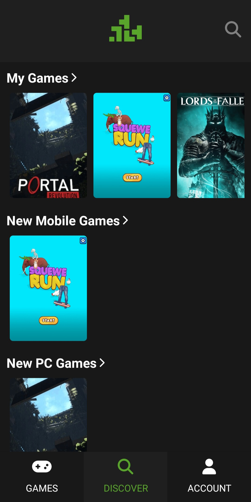
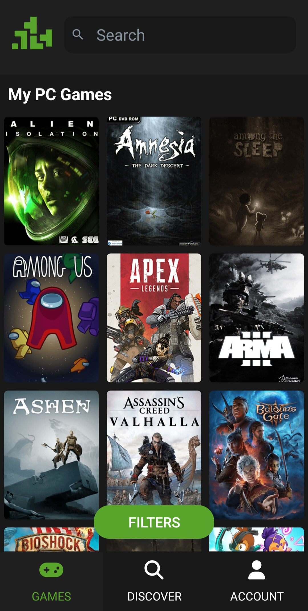

# Ratyagams

Ratyagams is a school project and a prototype for a mobile app that allows gamers to easily rate and review the video games they've played, providing a personal space to track and reflect on their gaming experiences.

## Features

- Personal Game Ratings: Rate the games you've played on a scale of 1 to 5 stars.
- Private Reviews: Write and save detailed reviews for each game, accessible only to you.
- Game Library: Browse and search through a comprehensive database of video games.
- Explore New Titles: Discover new games based on your interests.

## Tech Stack
- Frontend: React Native
- Backend: Managed through a [custom API](https://github.com/Umdromil14/APIProject)
- Back Office: Managed through a [dedicated back office](https://github.com/Umdromil14/backoffice)

## Screenshots

### Sign Up

### User Profile

### Home Screen

### Search Screen

  
  
  
  

### Game Rating

  
  

